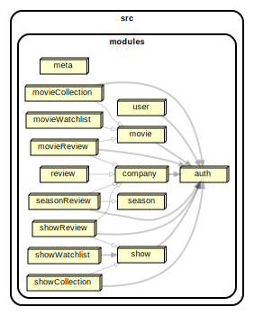

# Module structure

Framerate is generally structured into "modules" which exit to separate features, and are separated to ensure no circular dependencies. See the module dependency graph below outlines the basic dependency flow for all modules.

